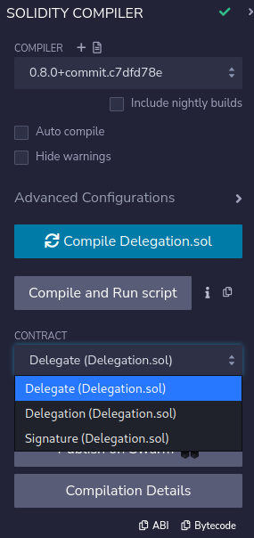

# 05: Token

The Ethernaut is a Web3/Solidity based wargame inspired by overthewire.org, played in the Ethereum Virtual Machine, in which each level is based on a smart contract that needs to be "hacked".

This is a sample walkthrough for the level called "Token".

## Setup

First off we need a wallet. Get the Metamask Wallet from https://metamask.io/ and choose whichever network works for you ( in my case i will be using Rinkeby's testnet).
Fund the wallet with Chainlink's faucet https://faucets.chain.link/rinkeby and then click on the button "Get new instance" to deploy the contract.

## Steps for completing the level
Click on F12 to get on Developer Tools. You will get something like this:

Go on Remix: https://remix.ethereum.org/ and make these changes in both Token.sol. 

Copy the Token.sol contract found before "submit instance" and "get new instance" buttons.

At Token.sol i made this next change:
>- <value> 1. Pragma version from **0.6.0** to **0.8.0** ( pragma versions higher than 0.8.0 don't have this level's exploit anymore)

This level wants from us to get more tokens from the total supply, but only if we manage somehow to access the total supply of the contract.

Compile the contract:

Now instead of deploying Token.sol we are going to interact with the already deployed contract by using instance address showed on Developer Tools. Also, dont forget to add your wallet on Environment by selecting "Injected Provider - Metamask".

After deploying Token.sol we can check our balance with balanceOf function:

Now to complete this level go and paste the level's address of the Token contract and a number of tokens greater than 20 ( to underflow the initial supply of tokens that you have ) into the transfer function and then hit the "transfer" button:

After that, try and check balanceOf function:

Wow, congrats!! Now you have an infinite amount of tokens, but also you have completed this level.

Now finish the level by using the submit button at the bottom of the page.

Congrats! See you on to the next level.:wave: