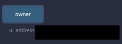

# 06: Delegation

The Ethernaut is a Web3/Solidity based wargame inspired by overthewire.org, played in the Ethereum Virtual Machine, in which each level is based on a smart contract that needs to be "hacked".

This is a sample walkthrough for the level called "Delegation".

## Setup

First off we need a wallet. Get the Metamask Wallet from https://metamask.io/ and choose whichever network works for you ( in my case i will be using Rinkeby's testnet).
Fund the wallet with Chainlink's faucet https://faucets.chain.link/rinkeby and then click on the button "Get new instance" to deploy the contract.

## Steps for completing the level
Click on F12 to get on Developer Tools. You will get something like this:

Go on Remix: https://remix.ethereum.org/ and make this change in Delegation.sol. 

Copy the Delegation.sol contract found before "submit instance" and "get new instance" buttons.

At Delegation.sol i made this next change:
>- <value> 1. Pragma version from **0.6.0** to **0.8.0**

This level wants from us to become the owner of the Delegation contract, but the only way to accomplish that is to call the delegatecall function inside of the fallback function by encoding the "pwn()" function using the abi.encodeWithSignature function from Solidity, inside a new contract that we gonna call Signature.

At the Signature contract add the getSig function:
>- <value> function getSig() public pure returns (bytes memory){
>- <value> return abi.encodeWithSignature("pwn()");}

It should look something like this:

Compile the contracts:

For this section we are going to interact only with Delegation and Signature contracts. Instead of deploying Delegation.sol we are going to interact with the already deployed contract by using instance address showed on Developer Tools and we will be deploying ourselves the Signature contract to the Rinkeby's Testnet. Also, dont forget to add your wallet on Environment by selecting "Injected Provider - Metamask".

After importing the instance's address of Delegation.sol we can see that the owner of the contract is the level's address:

Use the getSig function to encode the "pwn()" function into the bytes format  :

Now go back to the Ethernaut website, open the Developer Tools with F12 and send the bytes output of "pwn()" function:

Try again the owner function from the Delegate contract:

Wow, congrats!! Now you are the owner of the Delegate contract, but also you have completed this level.

Now finish the level by using the submit button at the bottom of the page.

Congrats! See you on to the next level.:wave: